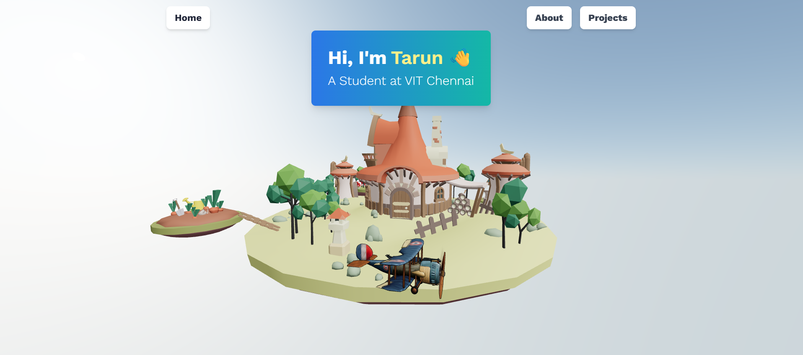
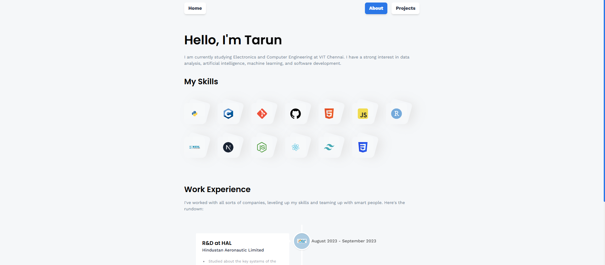

# 3D Portfolio Website

A modern and interactive portfolio website built with React, Three.js, and TailwindCSS.



## 🚀 Features

- ⚡️ Interactive 3D Island Model
- 🎨 Dynamic Color Schemes
- 📱 Fully Responsive Design
- 🎭 Smooth Page Transitions
- 💻 Modern UI/UX
- 🌈 Neo-brutalism Design Elements

## 🛠️ Tech Stack

- React.js
- Three.js
- React Three Fiber
- React Three Drei
- EmailJS
- Tailwind CSS
- Framer Motion

## 📝 Project Structure

```text
/
├── public/
├── src/
│   ├── assets/
│   ├── components/
│   │   ├── Alert.jsx
│   │   ├── CTA.jsx
│   │   ├── Navbar.jsx
│   │   └── ...
│   ├── models/
│   │   ├── Island.jsx
│   │   └── Sky.jsx
│   ├── pages/
│   │   ├── About.jsx
│   │   ├── Contact.jsx
│   │   ├── Home.jsx
│   │   └── Projects.jsx
│   └── App.jsx
└── package.json
```

## 📸 Screenshots

### Home Page with 3D Island


### Projects Section


### Contact Form


## 🚀 Getting Started

### Prerequisites
- Node.js (version 14 or higher)
- npm or yarn

### Installation

1. Clone the repository
```bash
git clone https://github.com/yourusername/portfolio-3d.git
```

2. Install dependencies
```bash
cd portfolio-3d
npm install
```

3. Start the development server
```bash
npm run dev
```

4. Build for production
```bash
npm run build
```

## 🎮 Usage

- **Navigation**: Use the navbar to explore different sections
- **3D Interaction**: Click and drag to rotate the 3D island
- **Contact Form**: Fill out the form to send messages directly
- **Project Cards**: Hover over project cards for more information

## 📜 License

This project is licensed under the MIT License - see the [LICENSE](LICENSE) file for details.

## 🤝 Contact

Your Name - [your@email.com](mailto:your@email.com)

Project Link: [https://github.com/yourusername/portfolio-3d](https://github.com/yourusername/portfolio-3d)
